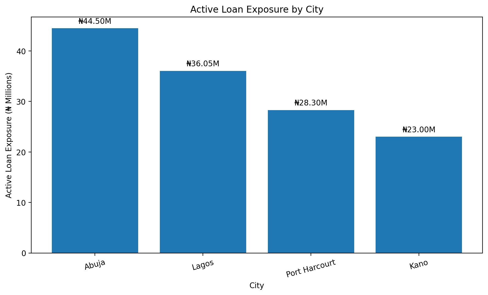
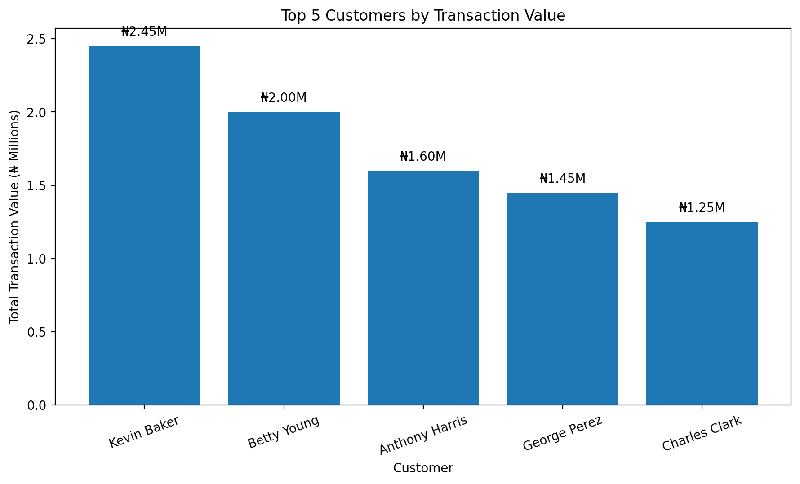
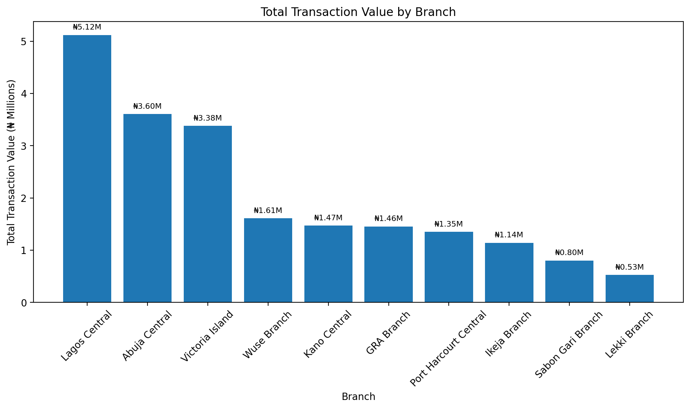

# Banking Customer & Financial Performance Analysis

## Project Overview

This project explores customer behavior, account activity, transactions, loans, and branch performance within a fictional banking institution.

Using MySQL, I analyzed a relational banking dataset to answer practical business questions around customer value, financial activity, loan exposure, and branch performance.

Rather than focusing only on writing SQL queries, the project follows a business-driven approach: identifying questions, analyzing the data, uncovering patterns, and translating those patterns into actionable business insights.

## Business Objectives

The project uses a relational banking database in which the tables are connected through primary and foreign keys.

1. Identify high-value customers based on account balances, income, and transaction activity.

2. Analyze customer transaction behavior, including deposits, withdrawals, transfers, and payments.

3. Evaluate the bank's loan portfolio and identify areas of significant active-loan exposure.

4. Compare branch-level performance using account balances, transaction activity, and customer accounts.

5. Segment customers based on income and financial activity to identify meaningful customer groups.

6. Use SQL-driven analysis to uncover patterns that could support customer management, lending decisions, and branch-level decision-making.

## Dataset

The project uses a fictional relational banking dataset consisting of five interconnected tables:

| Table | Records | Description |
|---|---:|---|
| Customers | 40 | Customer demographics, occupations, and income |
| Accounts | 40 | Customer accounts, balances, types, and status |
| Transactions | 80 | Deposits, withdrawals, transfers, and payments |
| Loans | 30 | Customer loans, amounts, interest rates, and status |
| Branches | 10 | Branch information and management details |

## Tools Used

- MySQL
- MySQL Workbench
- SQL
- GitHub
## Key Findings

The analysis revealed several notable patterns across customer activity, transactions, loans, and branches.

### Customer & Transaction Activity

- The dataset contains 40 customers and 40 accounts across multiple Nigerian cities.
- 80 transactions were analyzed across deposits, withdrawals, transfers, and payments.
- Kevin Baker recorded the highest total transaction value at ₦2.45M, followed by Betty Young at ₦2.00M and Anthony Harris at ₦1.60M.

### Loan Portfolio

- The loan portfolio contains 30 loans, consisting of 23 active loans and 7 completed loans.
- Abuja recorded the highest total active-loan exposure at ₦44.5M.
- Lagos followed with ₦36.05M, while Port Harcourt and Kano recorded ₦28.3M and ₦23M respectively.

### High-Value Customer Exposure

- Six customers recorded more than ₦1M in total transaction value while also having an active loan above ₦3M.
- This group represents customers with both significant financial activity and substantial outstanding loan exposure.

### Branch Performance

- Branch-level analysis was used to compare account counts, account balances, and transaction activity.
- This provides a basis for identifying branches with higher levels of customer and financial activity.
## Business Recommendations

Based on the patterns identified in the analysis, the following actions could be considered by the bank:

### 1. Strengthen High-Value Customer Management

Customers with high transaction activity and significant account balances could be considered for targeted relationship-management strategies, personalized financial products, and retention initiatives.

### 2. Monitor High Loan-Exposure Customers

Customers combining substantial transaction activity with large active loans could receive closer portfolio monitoring. Their transaction behavior and repayment performance could be reviewed together to support responsible credit management.

### 3. Review Regional Loan Exposure

Abuja recorded the highest active-loan exposure in the dataset. Management could investigate the drivers of this concentration and compare loan performance across cities before making lending decisions.

### 4. Use Branch-Level Performance for Resource Planning

Differences in account balances, customer accounts, and transaction activity across branches could help inform decisions about staffing, service capacity, and customer acquisition efforts.

### 5. Develop Customer Segmentation Strategies

Income and financial-activity patterns could be used to create customer segments and tailor products or services to different customer groups.

> **Note:** These recommendations are based on patterns in a fictional dataset and are intended to demonstrate analytical reasoning rather than represent real banking decisions.
## SQL Techniques Demonstrated

This project demonstrates a range of SQL techniques used to investigate and analyze relational banking data.

- `SELECT` and `WHERE` for data retrieval and filtering
- `ORDER BY` and `LIMIT` for sorting and identifying top records
- Aggregate functions: `COUNT()`, `SUM()`, `AVG()`, `MIN()`, and `MAX()`
- `GROUP BY` and `HAVING` for grouped analysis and filtering
- `INNER JOIN` and `LEFT JOIN` for combining related tables
- `CASE WHEN` for customer segmentation and conditional analysis
- Subqueries for comparing records against calculated benchmarks
- Common Table Expressions (`CTEs`) for structuring multi-step analysis
- Window functions including `ROW_NUMBER()` and `DENSE_RANK()`
- `PARTITION BY` for ranking customers within cities
- Date filtering for time-based transaction analysis

## Project Visualizations

### Active Loan Exposure by City



### Top 5 Customers by Transaction Value



### Total Transaction Value by Branch


## Project Structure

```text
banking-customer-financial-analysis/
├── README.md
├── sql/
│   └── banking_analysis.sql
└── data/
    ├── customers.csv
    ├── accounts.csv
    ├── transactions.csv
    ├── loans.csv
    └── branches.csv
```

## Data Model & Relationships

The project uses a relational banking database in which the tables are connected through primary and foreign keys.

```text
Customers
   │
   ├── Accounts ─── Transactions
   │       │
   │       └── Branches
   │
   └── Loans
```

### Table Relationships

- Customers → Accounts: `customer_id`
- Customers → Loans: `customer_id`
- Accounts → Transactions: `account_id`
- Accounts → Branches: `branch_id`


### Relationship Logic

Transactions are linked to customers indirectly through accounts:

**Customers → Accounts → Transactions**

This allows transaction activity to be analyzed at the customer level while maintaining a normalized relational structure.
